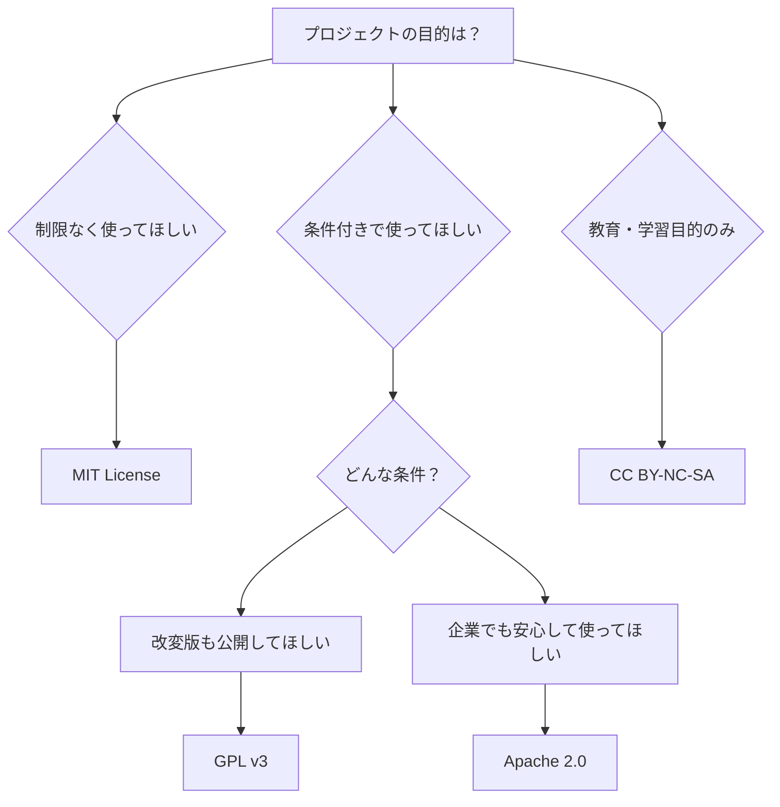
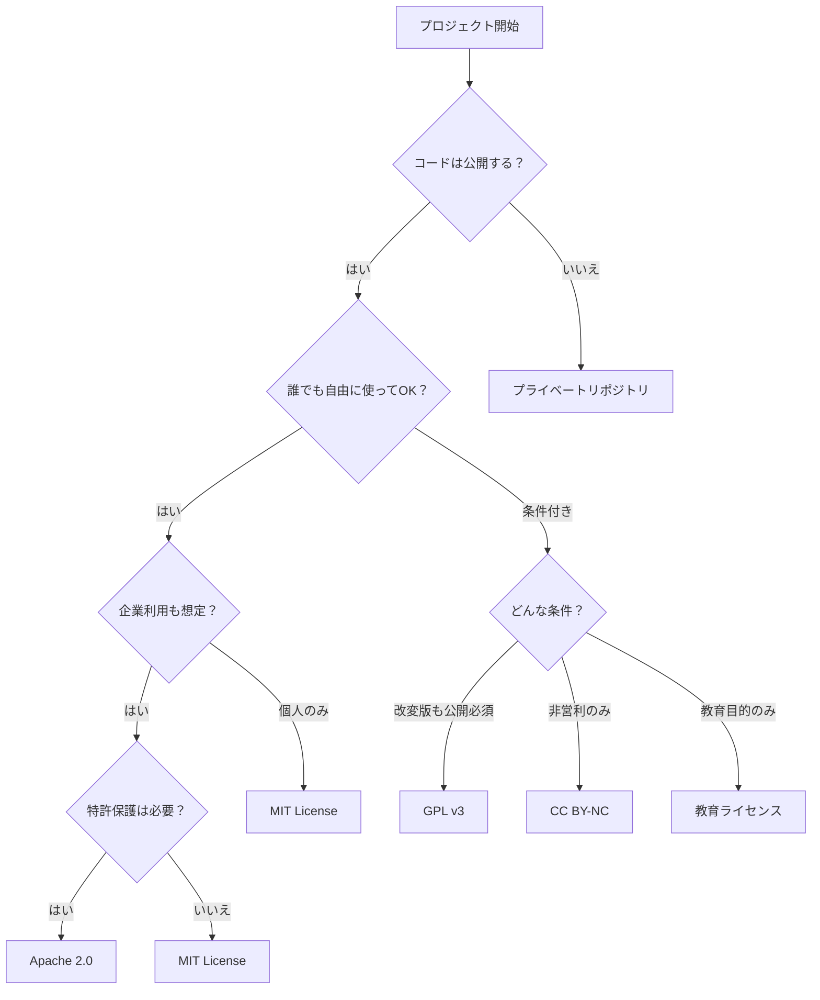

# 初心者向けライセンス選択ガイド

## 🎯 3つの質問で最適なライセンスを選ぶ

### 質問1: 他の人にどう使ってもらいたい？



### 質問2: 誰が使うことを想定している？

| 想定ユーザー | おすすめライセンス | 理由 |
|------------|------------------|------|
| 個人開発者 | MIT | シンプルで理解しやすい |
| 企業 | Apache 2.0 | 特許関連の保護がある |
| 教育機関 | CC BY-SA | 教育利用に適している |
| 誰でも | CC0 | 完全にパブリックドメイン |

### 質問3: あなたの優先事項は？

- **最大限の自由** → MIT License
- **コミュニティの成長** → Apache 2.0
- **オープンソースの維持** → GPL v3
- **クレジット表示** → CC BY

## 📊 人気ライセンス比較表

| 特徴 | MIT | Apache 2.0 | GPL v3 | BSD | CC0 |
|------|-----|------------|--------|-----|-----|
| 商用利用 | ✅ | ✅ | ✅ | ✅ | ✅ |
| 修正 | ✅ | ✅ | ✅ | ✅ | ✅ |
| 配布 | ✅ | ✅ | ✅ | ✅ | ✅ |
| 私的利用 | ✅ | ✅ | ✅ | ✅ | ✅ |
| **条件** |
| ライセンス表示 | ✅ | ✅ | ✅ | ✅ | ❌ |
| 著作権表示 | ✅ | ✅ | ✅ | ✅ | ❌ |
| 同一ライセンス | ❌ | ❌ | ✅ | ❌ | ❌ |
| 変更内容の明記 | ❌ | ✅ | ✅ | ❌ | ❌ |
| **保護** |
| 責任制限 | ✅ | ✅ | ✅ | ✅ | ❌ |
| 保証免責 | ✅ | ✅ | ✅ | ✅ | ❌ |
| 特許保護 | ❌ | ✅ | ✅ | ❌ | ❌ |

## 🎓 学生・初心者におすすめのライセンス

### 1. MIT License（最も人気）

```
MIT License

Copyright (c) [年] [あなたの名前]

Permission is hereby granted, free of charge...
```

**メリット：**
- ✅ 非常にシンプル
- ✅ 制限が少ない
- ✅ 企業も安心して使える
- ✅ 世界中で広く使われている

**こんな場合におすすめ：**
- 初めてのオープンソースプロジェクト
- 多くの人に使ってもらいたい
- 複雑な条件を避けたい

### 2. Apache License 2.0（企業向け）

**メリット：**
- ✅ 特許に関する条項がある
- ✅ 大企業も安心
- ✅ 貢献者の保護が手厚い

**こんな場合におすすめ：**
- 企業での利用を想定
- 特許が関わる可能性がある
- より正式なプロジェクト

### 3. Creative Commons（クリエイティブ作品向け）

**種類：**
- **CC0** - パブリックドメイン（完全自由）
- **CC BY** - クレジット表示のみ必要
- **CC BY-SA** - クレジット表示＋同一ライセンス
- **CC BY-NC** - 非営利のみ
- **CC BY-NC-SA** - 非営利＋同一ライセンス

**こんな場合におすすめ：**
- ドキュメント、画像、音楽など
- 教材や学習資料
- アート作品

## 🚦 ライセンス選択フローチャート



## 💡 プロジェクトタイプ別おすすめ

### Webアプリケーション
- **フロントエンド**: MIT
- **バックエンド**: MIT or Apache 2.0
- **フレームワーク**: Apache 2.0

### 学習・教材
- **プログラミング教材**: CC BY-SA
- **サンプルコード**: MIT
- **ドキュメント**: CC BY

### ライブラリ・ツール
- **ユーティリティ**: MIT
- **開発ツール**: MIT or Apache 2.0
- **プラグイン**: 本体と同じライセンス

### 学生プロジェクト
- **個人作品**: MIT
- **グループワーク**: MIT（シンプル）
- **卒業制作**: Apache 2.0（しっかり）

## ⚠️ 避けるべき間違い

### 1. ライセンスなし
```markdown
❌ 悪い例：
# My Project
素晴らしいプロジェクトです！
（ライセンス記載なし）
```

### 2. 不適切な組み合わせ
```markdown
❌ 悪い例：
このコードはMITライセンスですが、
商用利用は禁止します。（矛盾している）
```

### 3. 独自ライセンス
```markdown
❌ 悪い例：
「私の気分次第で使用を許可します」
（法的に不明確）
```

## 🎯 実践的な選択例

### ケース1: プログラミング初心者の練習プロジェクト
**状況**: HTMLとCSSの練習で作ったWebサイト
**選択**: **MIT License**
**理由**: シンプルで、他の初心者も参考にできる

### ケース2: 学校の課題で作ったアプリ
**状況**: チームで開発したTodoアプリ
**選択**: **MIT License**
**理由**: メンバー全員が理解しやすく、将来の就活でも使える

### ケース3: 教材として公開するサンプルコード
**状況**: プログラミング授業用のサンプル
**選択**: **CC0** または **MIT**
**理由**: 学生が自由に使って学習できる

### ケース4: 革新的なアルゴリズムを含むプロジェクト
**状況**: 新しい機械学習手法の実装
**選択**: **Apache 2.0**
**理由**: 特許保護があり、企業も研究に使える

## 📝 ライセンス選択チェックリスト

選択前に確認すべきポイント：

- [ ] プロジェクトの目的は明確か？
- [ ] 想定する利用者は誰か？
- [ ] 商用利用を許可するか？
- [ ] 改変を許可するか？
- [ ] クレジット表示を求めるか？
- [ ] 派生物のライセンスを制限するか？
- [ ] 特許に関する懸念はあるか？
- [ ] 使用する他のライブラリのライセンスと互換性があるか？

## 🔄 ライセンスの互換性

### 組み合わせ可能 ✅
- MIT + MIT
- MIT + Apache 2.0
- MIT + BSD
- Apache 2.0 + Apache 2.0

### 注意が必要 ⚠️
- GPL + MIT（GPLが全体に適用される）
- Apache 2.0 + GPL v2（互換性問題）

### 組み合わせ不可 ❌
- 独占的ライセンス + オープンソース
- 異なるコピーレフトライセンス

## 🎓 まとめ：初心者は MIT から始めよう

**MIT License を選ぶ理由：**
1. **シンプル** - 理解しやすい
2. **自由** - 制限が少ない
3. **人気** - 多くのプロジェクトで使用
4. **安全** - 法的リスクが低い

慣れてきたら、プロジェクトの性質に応じて他のライセンスも検討しましょう。

## 📚 次のステップ

1. ライセンスを選んだら → [ライセンスの追加方法](./adding-license)
2. もっと詳しく知りたい → [ライセンスの詳細解説](./license-details)
3. 教育での活用 → [教育現場向けガイド](./education-guide)

選択に迷ったら、MIT License から始めることをおすすめします！