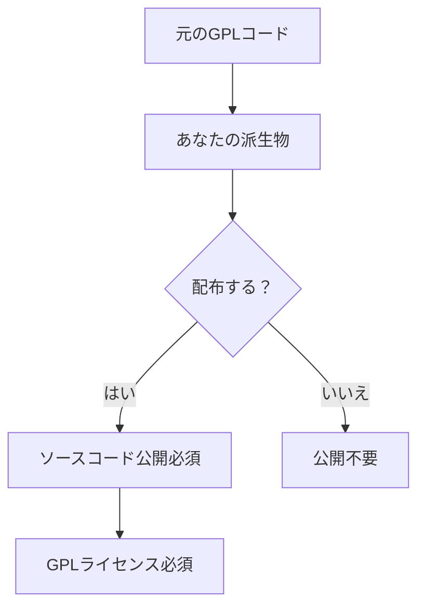
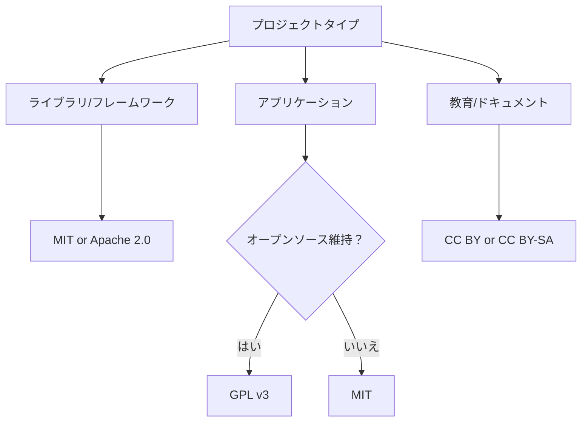

# 主要ライセンスの詳細解説

## 📑 MIT License

### 概要
最もシンプルで制限の少ないライセンスの一つ。短く理解しやすいため、世界中で最も人気があります。

### 主な条件
✅ **許可されること：**
- 商用利用
- 修正
- 配布
- 私的利用

⚠️ **義務：**
- ライセンスと著作権表示を含める

❌ **責任：**
- 作者は一切の責任を負わない

### ライセンス全文（日本語訳付き）

```
MIT License

Copyright (c) [year] [fullname]

Permission is hereby granted, free of charge, to any person obtaining a copy
of this software and associated documentation files (the "Software"), to deal
in the Software without restriction, including without limitation the rights
to use, copy, modify, merge, publish, distribute, sublicense, and/or sell
copies of the Software, and to permit persons to whom the Software is
furnished to do so, subject to the following conditions:

The above copyright notice and this permission notice shall be included in all
copies or substantial portions of the Software.

THE SOFTWARE IS PROVIDED "AS IS", WITHOUT WARRANTY OF ANY KIND, EXPRESS OR
IMPLIED, INCLUDING BUT NOT LIMITED TO THE WARRANTIES OF MERCHANTABILITY,
FITNESS FOR A PARTICULAR PURPOSE AND NONINFRINGEMENT. IN NO EVENT SHALL THE
AUTHORS OR COPYRIGHT HOLDERS BE LIABLE FOR ANY CLAIM, DAMAGES OR OTHER
LIABILITY, WHETHER IN AN ACTION OF CONTRACT, TORT OR OTHERWISE, ARISING FROM,
OUT OF OR IN CONNECTION WITH THE SOFTWARE OR THE USE OR OTHER DEALINGS IN THE
SOFTWARE.

【日本語訳】
本ソフトウェアおよび関連文書ファイル（以下「ソフトウェア」）の複製を取得する
すべての人に対し、ソフトウェアを無制限に扱うことを無償で許可します。これには、
ソフトウェアの複製を使用、複写、変更、結合、掲載、頒布、サブライセンス、
および/または販売する権利、およびソフトウェアを提供する相手に同じことを許可する
権利も無制限に含まれます。

上記の著作権表示および本許諾表示を、ソフトウェアのすべての複製または
重要な部分に記載するものとします。

ソフトウェアは「現状のまま」で、明示であるか暗黙であるかを問わず、
何らの保証もなく提供されます。
```

### 使用例
- **React** - Facebook製のUIライブラリ
- **jQuery** - JavaScriptライブラリ
- **Rails** - Ruby on Railsフレームワーク
- **Bootstrap** - CSSフレームワーク

### こんな場合に最適
- 🎓 学生の個人プロジェクト
- 🚀 スタートアップの初期プロダクト
- 📚 教育用サンプルコード
- 🛠️ 汎用的なツールやライブラリ

## 🔧 Apache License 2.0

### 概要
MITライセンスより詳細で、特許に関する条項を含む。大企業やエンタープライズ向けプロジェクトで人気。

### 主な条件
✅ **許可されること：**
- 商用利用
- 修正
- 配布
- 特許使用
- 私的利用

⚠️ **義務：**
- ライセンスと著作権表示
- 変更内容の明記
- NOTICEファイルの保持

❌ **責任：**
- 作者は責任を負わない
- 商標使用は許可されない

### 重要な条項

#### 特許権の許諾（第3条）
```
各貢献者は、あなたに対し、永続的で世界規模の非独占的な
無料のロイヤリティフリーの取消不能な特許ライセンスを許諾します。
```

#### 変更の明記（第4条）
```
あなたが変更したファイルには、あなたが変更したことを示す
目立つ通知を付けなければなりません。
```

### 使用例
- **Android** - Googleのモバイルプラットフォーム
- **Apache HTTP Server** - Webサーバー
- **Kotlin** - プログラミング言語
- **TensorFlow** - 機械学習フレームワーク

### NOTICEファイルの例
```
Apache Project
Copyright 2024 The Apache Software Foundation

This product includes software developed at
The Apache Software Foundation (http://www.apache.org/).

Portions of this software were developed at
National Center for Supercomputing Applications (NCSA) at the
University of Illinois at Urbana-Champaign.
```

## 🔒 GNU General Public License v3.0 (GPL v3)

### 概要
「コピーレフト」ライセンスの代表。派生物も同じライセンスで公開することを要求する。

### 主な条件
✅ **許可されること：**
- 商用利用
- 修正
- 配布
- 特許使用
- 私的利用

⚠️ **義務：**
- ソースコードの開示
- ライセンスと著作権表示
- 同一ライセンスの使用
- 変更内容の明記

❌ **責任：**
- 作者は責任を負わない

### コピーレフトの仕組み



### GPLの「感染性」
```javascript
// gpl-library.js (GPL v3)
export function gplFunction() {
    return "GPL licensed";
}

// your-app.js
import { gplFunction } from './gpl-library.js';
// このアプリ全体がGPL v3になる！
```

### 使用例
- **Linux Kernel** - オペレーティングシステムの核
- **WordPress** - CMSプラットフォーム
- **GIMP** - 画像編集ソフト
- **Git** - バージョン管理システム

## 🎨 Creative Commons ライセンス

### 概要
主にクリエイティブ作品（文書、画像、音楽など）向けのライセンス体系。

### ライセンスの種類

#### CC0 (パブリックドメイン)
```
完全に自由。著作権を放棄。
✅ 商用利用 ✅ 改変 ✅ 再配布
❌ 条件なし
```

#### CC BY (表示)
```
クレジット表示のみ必要
✅ 商用利用 ✅ 改変 ✅ 再配布
⚠️ 著作者表示
```

#### CC BY-SA (表示-継承)
```
クレジット表示＋同一ライセンス
✅ 商用利用 ✅ 改変 ✅ 再配布
⚠️ 著作者表示 ⚠️ 同一ライセンス
```

#### CC BY-NC (表示-非営利)
```
非営利目的のみ
❌ 商用利用 ✅ 改変 ✅ 再配布
⚠️ 著作者表示
```

#### CC BY-NC-SA (表示-非営利-継承)
```
非営利＋同一ライセンス
❌ 商用利用 ✅ 改変 ✅ 再配布
⚠️ 著作者表示 ⚠️ 同一ライセンス
```

#### CC BY-ND (表示-改変禁止)
```
改変禁止
✅ 商用利用 ❌ 改変 ✅ 再配布
⚠️ 著作者表示
```

### 表示例
```markdown
この作品は [クリエイティブ・コモンズ 表示 4.0 国際 ライセンス](https://creativecommons.org/licenses/by/4.0/)
の下に提供されています。
```

## 📊 ライセンス比較表

### 基本的な権利

| ライセンス | 商用利用 | 改変 | 配布 | 私的利用 | 特許許諾 |
|----------|---------|-----|-----|---------|---------|
| MIT | ✅ | ✅ | ✅ | ✅ | ❌ |
| Apache 2.0 | ✅ | ✅ | ✅ | ✅ | ✅ |
| GPL v3 | ✅ | ✅ | ✅ | ✅ | ✅ |
| BSD 3-Clause | ✅ | ✅ | ✅ | ✅ | ❌ |
| CC0 | ✅ | ✅ | ✅ | ✅ | ❌ |

### 義務と条件

| ライセンス | 著作権表示 | ライセンス表示 | ソース開示 | 同一ライセンス | 変更明記 |
|----------|-----------|--------------|-----------|--------------|---------|
| MIT | ✅ | ✅ | ❌ | ❌ | ❌ |
| Apache 2.0 | ✅ | ✅ | ❌ | ❌ | ✅ |
| GPL v3 | ✅ | ✅ | ✅ | ✅ | ✅ |
| BSD 3-Clause | ✅ | ✅ | ❌ | ❌ | ❌ |
| CC0 | ❌ | ❌ | ❌ | ❌ | ❌ |

## 🎯 使い分けガイド

### プロジェクトタイプ別推奨



### 企業での使用を考慮

| 状況 | 推奨ライセンス | 理由 |
|-----|--------------|------|
| スタートアップ | MIT | シンプルで理解しやすい |
| 大企業 | Apache 2.0 | 特許保護がある |
| オープンソース企業 | GPL v3 | ビジネスモデルを保護 |
| SaaS企業 | AGPL v3 | ネットワーク使用も制御 |

## 🚨 注意事項

### ライセンスの互換性

```
MIT → Apache 2.0 ✅ 可能
MIT → GPL v3 ✅ 可能（GPLになる）
Apache 2.0 → GPL v3 ✅ 可能（条件付き）
GPL v3 → MIT ❌ 不可能
```

### デュアルライセンスの例

```markdown
# Dual Licensing

This software is available under two different licenses:

1. **GNU General Public License v3.0** - for open source projects
2. **Commercial License** - for proprietary use

Please contact sales@example.com for commercial licensing.
```

## 📚 その他の重要なライセンス

### BSD License (2-Clause & 3-Clause)
- MITに似ているが、より正式
- 3-Clauseは名前の使用を制限

### ISC License
- MITよりさらにシンプル
- OpenBSDプロジェクトで使用

### Mozilla Public License 2.0
- ファイル単位のコピーレフト
- 商用製品との組み合わせが容易

### Unlicense
- パブリックドメインへの献呈
- CC0の代替

## 🎓 まとめ

1. **MIT** - 最も自由で簡単
2. **Apache 2.0** - 企業向けで安心
3. **GPL v3** - オープンソースを守る
4. **Creative Commons** - コード以外のコンテンツ

選択に迷ったら、プロジェクトの目的と将来の使用方法を考慮して選びましょう。

## 📖 次のステップ

- [教育現場向けガイド](./education-guide) - 学校での活用方法